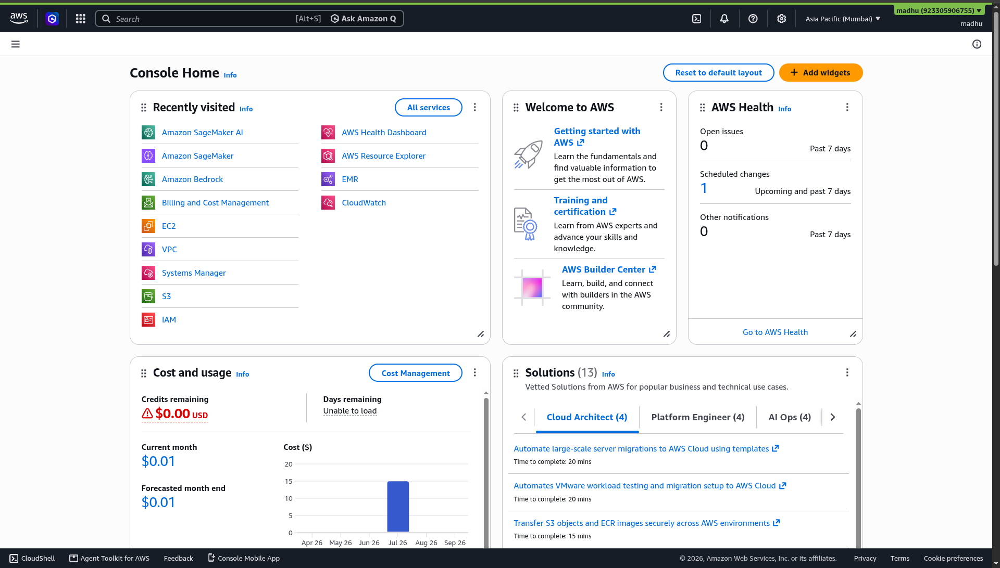

# Chapter 01 — Welcome & Intro to AWS SBG DBIT

**Day 1 | 11:15 AM – 11:45 AM | 30 minutes**

---

  
    
  <b>HexaVerse CloudFest '26</b> 
  AWS Builders Lab — Don Bosco Institute of Technology, Bengaluru

---

## 👥 Who is AWS Student Builder Group – DBIT?

**AWS Student Builder Group (SBG) – DBIT** is a student-driven cloud community at Don Bosco Institute of Technology, running in collaboration with the Department of AI & ML.

**What the community does:**
- Organizes hands-on workshops and technical events
- Connects students with AWS learning resources and career opportunities
- Creates peer learning through collaboration and community building
- Helps students build real skills for internships and placements

---

## 🎪 About This Workshop

**AWS Builders Lab** is a two-day, instructor-led, beginner-friendly workshop where you go from zero cloud experience to deploying real applications on AWS.

---

## 🗓️ Your Two-Day Journey

| | Day 1 | Day 2 |
|---|---|---|
| **Date** | 21 September 2026 | 22 September 2026 |
| **Time** | 11:15 AM – 3:00 PM | 10:00 AM – 1:15 PM |
| **Focus** | Cloud Fundamentals & Core Services | MLOps & Generative AI |
| **You will** | Set up IAM, host on S3, launch EC2, explore Bedrock | Build ML model, use PartyRock, plan certification |

---

## 📸 Share the Moment

You are at **AWS Builders Lab**. Post about it!

> 📸 Take a photo of your setup and tag us:
> **[@awssbg_dbit](https://www.instagram.com/awssbg_dbit/)** on Instagram
> Use the hashtag **#AWSBuildersLab** and **#HexaVerse26**

---

## 🖥️ Your AWS Console

This is what your AWS Management Console looks like once you're logged in. All the services you'll use today are reachable from here.

  
   
  <em>AWS Management Console — starting point for every lab</em>

---

## ✅ Chapter Checklist

- [ ] I understand what AWS Student Builder Group – DBIT is
- [ ] I know the two-day agenda
- [ ] My laptop is open and AWS Console is accessible
- [ ] I tagged or followed [@awssbg_dbit](https://www.instagram.com/awssbg_dbit/) on Instagram

---

## 🏆 Badge Unlocked

> ### ☁️ CLOUD NEWCOMER
> You have taken your first step into the cloud.

---

> ✅ **Done? Move to the next chapter:**
> ### 👉 [Chapter 02 — Icebreaker & Settle-In](02-icebreaker.md)
