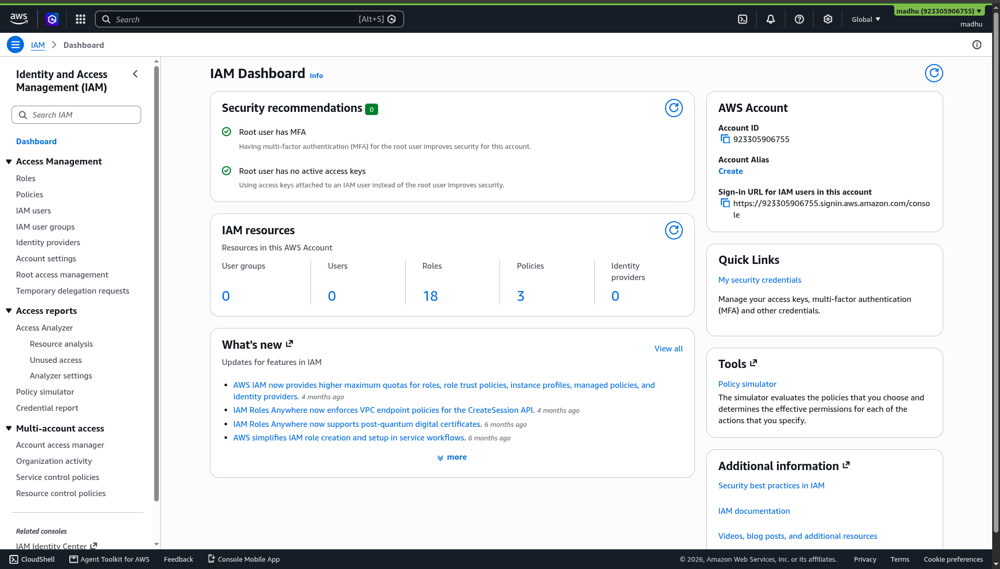
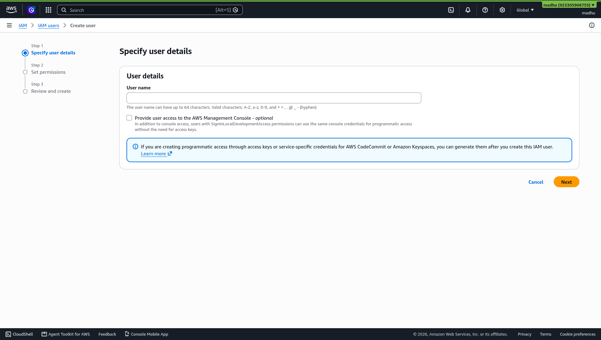
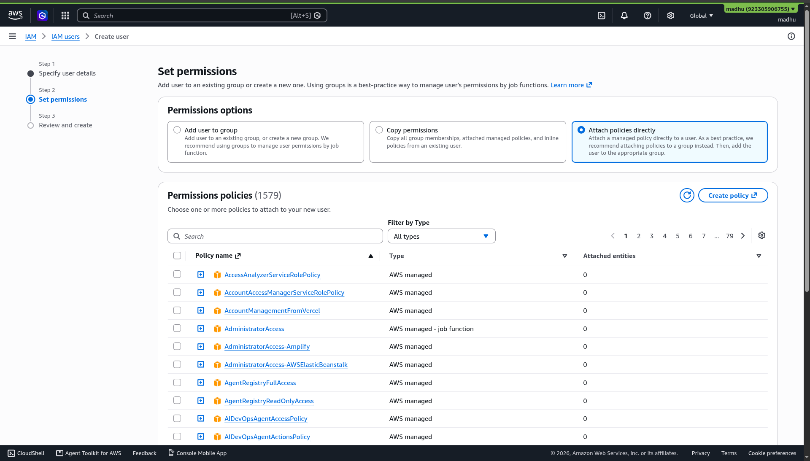

# Chapter 05 — Hands-On Lab: AWS IAM User Setup

**Day 1 | 12:20 PM – 12:40 PM | Core Lab**

---

## 🎯 What You Will Do

Create a new IAM user with AWS Console access — the secure, professional way to work on AWS.

---

## 🔐 What is AWS IAM?

<p align="center">
  
  <br/>
  <b>AWS Identity and Access Management</b>
</p>

IAM controls two things:

- **Authentication** — Who can log into your AWS account
- **Authorization** — What they are allowed to create, view, or delete

Think of it as a digital keycard system for your cloud environment. Every person gets their own keycard with exactly the doors they need access to — no more, no less.

---

## ❓ Why Not Just Use the Root Account?

<p align="center">

```
ROOT ACCOUNT              IAM USER
──────────────────────    ──────────────────────────────
Created at sign-up        Created by you for specific work
Unlimited access          Only the permissions you grant
Includes billing control  No billing access unless granted
NEVER share this          Safe to use for daily tasks
```

</p>

> **Golden Rule:** Create an IAM user for all hands-on work. Never use Root for daily tasks.

---

## 👣 Step-by-Step

### Step 1 — Open IAM

```
AWS Console → Search bar → Type: IAM → Click IAM
```

You will land on the **IAM Dashboard** — your access management control panel. Notice the Sign-in URL on the right — this is what your IAM users will use to log in.

<p align="center">
  
  <br/>
  <em>IAM Dashboard — shows Security recommendations, IAM resources count, and the account Sign-in URL</em>
</p>

---

### Step 2 — Go to Users and Start Creating

```
Left sidebar → IAM users → Click "Create user" (orange button, top right)
```

You will reach the **Specify user details** form (Step 1 of 3 in the wizard).

<p align="center">
  
  <br/>
  <em>Create user wizard — Step 1: enter the username and enable console access</em>
</p>

---

### Step 3 — Enter User Details

```
User name → Enter: workshop-student

✅ Check: "Provide user access to the AWS Management Console"

Password → Select: Custom password
           Enter a strong temporary password

✅ Keep: "Users must create a new password at next sign-in"

→ Click Next
```

---

### Step 4 — Assign Permissions

You are now on **Step 2: Set permissions**.

```
Permissions options → Select: Attach policies directly

Search box → Type: AdministratorAccess

✅ Check the box next to: AdministratorAccess

→ Click Next
```

<p align="center">
  
  <br/>
  <em>Step 2: Set permissions — select "Attach policies directly" then search for and check AdministratorAccess</em>
</p>

> 💡 **AdministratorAccess** grants full permissions — ideal for a learning sandbox. In production environments, always use the minimum permissions required.

---

### Step 5 — Review and Create

```
Review the User details and Permissions summary
→ Click "Create user"
```

---

### Step 6 — Save the Login Details

```
→ Click "Download .csv file"   ← Do this now
OR copy the Console sign-in URL
```

> ⚠️ This is the **only time** you can download these credentials. Do not skip this step.

---

### Step 7 — Verify the Login Works

```
Open a Private / Incognito browser window
Paste the Console sign-in URL
Enter: username + temporary password → Sign in
Set a new password when prompted
Confirm: You land on the AWS Console dashboard ✅
```

---

## ✅ Chapter Checklist

- [ ] IAM user created with Console access
- [ ] AdministratorAccess policy attached
- [ ] Credentials downloaded and saved
- [ ] New user login verified in incognito window

---

## 🌐 Share Your Progress

> 🎉 Just created your first AWS IAM user!
> Share it with the community: **[@awssbg_dbit](https://www.instagram.com/awssbg_dbit/)**
> **#AWSBuildersLab #IAM #HexaVerse26**

---

## 🏆 Badge Unlocked

> ### 🔐 IAM GUARDIAN
> You know how to secure cloud access the right way.

---

> ✅ **Done? Move to the next lab:**
> ### 👉 [Chapter 06 — Hands-On Lab: S3 Static Website](06-lab-s3.md)
