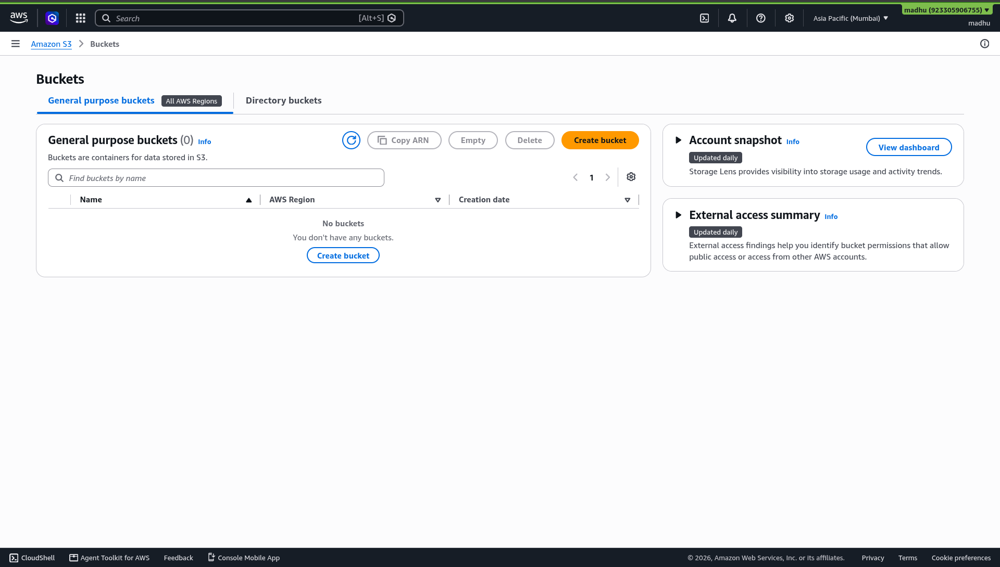
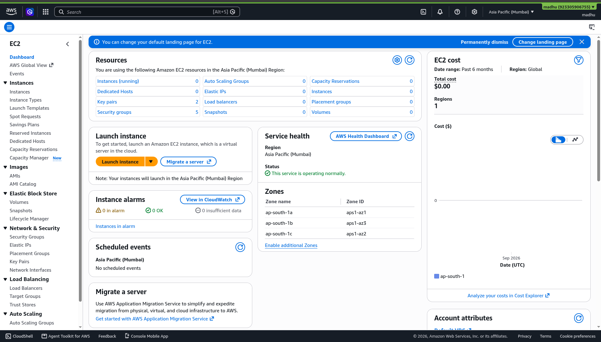
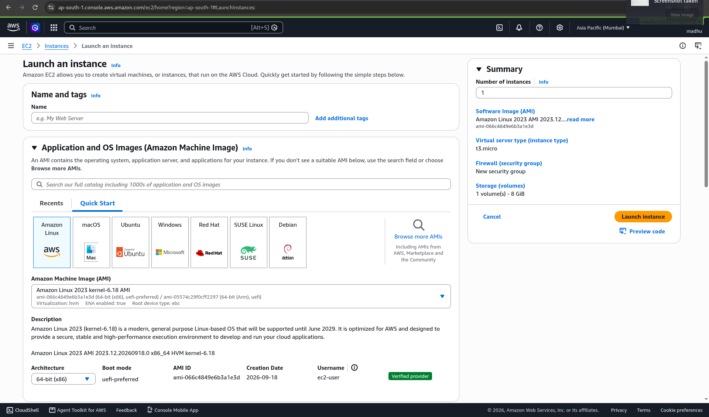
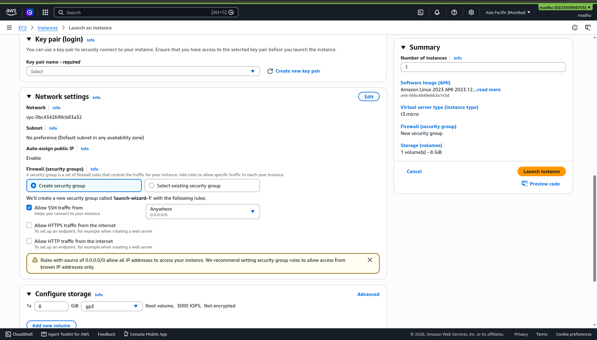
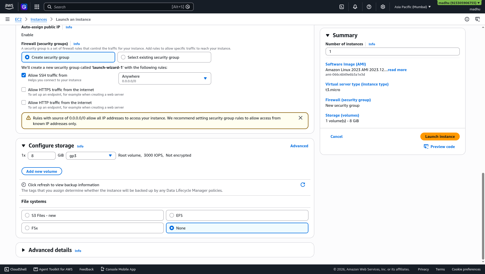

# Chapter 06 — Hands-On Lab: Amazon S3 Static Website

**Day 1 | 12:40 PM – 01:00 PM | Core Lab**

---

## 🎯 What You Will Do

Create an S3 bucket, upload a web page, and get your own website live on the internet — without touching a single server.

---

## 🪣 What is Amazon S3?

<p align="center">
  
  <br/>
  <b>Amazon Simple Storage Service</b>
</p>

S3 stores files in the cloud and gives each one a URL anyone can visit.

For web hosting this means:
- No server to buy or configure
- No web server software to install
- Upload an HTML file → it is instantly accessible on the internet
- Pay only for storage used

> S3 hosts **static** content only — HTML, CSS, JavaScript, images.
> It cannot run server-side code like Python or Node.js backends.

---

## 📋 Prepare These Files First

Create these two files on your laptop before starting.

**`index.html`** — open any text editor and paste:

```html
<!DOCTYPE html>
<html>
  <head>
    <title>My AWS S3 Website</title>
    <style>
      body { font-family: Arial, sans-serif; text-align: center;
             padding: 60px; background: #0f1117; color: #fff; }
      h1   { color: #FF9900; }
      p    { color: #ccc; }
    </style>
  </head>
  <body>
    <h1>☁️ Hello from Amazon S3!</h1>
    <p>Hosted during AWS Builders Lab — HexaVerse CloudFest '26</p>
    <p>Built by: <strong>YOUR NAME HERE</strong></p>
  </body>
</html>
```

**`error.html`** — paste:

```html
<!DOCTYPE html>
<html>
  <body style="font-family:Arial;text-align:center;padding:60px;">
    <h1>404 — Page Not Found</h1>
    <a href="index.html">← Go back home</a>
  </body>
</html>
```

**Bucket name** — choose something globally unique, for example:
`my-dbit-website-` + your roll number

---

## 👣 Step-by-Step

### Phase A — Create the S3 Bucket

```
AWS Console → Search: S3 → Click S3 → Click "Create bucket"

Bucket name  →  Enter your unique bucket name
AWS Region   →  Asia Pacific (Mumbai) ap-south-1

Object Ownership  →  Leave: ACLs disabled (recommended)

Block Public Access:
  ☐ UNCHECK "Block all public access"
  ✅ CHECK  "I acknowledge that current settings might result
             in this bucket and objects becoming public"

Bucket Versioning  →  Disable
Encryption         →  Leave default

→ Click "Create bucket"
```

<p align="center">
  
  <br/>
  <em>S3 Console — click "Create bucket" to get started</em>
</p>

---

### Phase B — Upload Your Files

```
Click your bucket name in the list
Objects tab → Click "Upload"
→ Add files → Select index.html and error.html
→ Click "Upload"
→ Wait for green "Upload succeeded" banner → Click "Close"
```

<p align="center">
  
  <br/>
  <em>Your bucket is created — click Upload to add your HTML files</em>
</p>

<p align="center">
  
  <br/>
  <em>Upload succeeded — both index.html and error.html are now in your bucket</em>
</p>

---

### Phase C — Enable Static Website Hosting

```
Properties tab → Scroll to bottom → "Static website hosting" → Edit

Static website hosting  →  Enable
Hosting type            →  Host a static website
Index document          →  index.html
Error document          →  error.html

→ Click "Save changes"
```

<p align="center">
  
  <br/>
  <em>Enable static website hosting and set index.html as the root document</em>
</p>

---

### Phase D — Add the Public Bucket Policy

```
Permissions tab → Bucket policy → Edit
```

Paste this — replace `YOUR-BUCKET-NAME` with your actual bucket name:

```json
{
  "Version": "2012-10-17",
  "Statement": [
    {
      "Sid": "PublicReadGetObject",
      "Effect": "Allow",
      "Principal": "*",
      "Action": "s3:GetObject",
      "Resource": "arn:aws:s3:::YOUR-BUCKET-NAME/*"
    }
  ]
}
```

```
→ Click "Save changes"
```

<p align="center">
  
  <br/>
  <em>Paste the bucket policy and save — this makes your files publicly readable</em>
</p>

---

### Phase E — Visit Your Live Website

```
Properties tab → Static website hosting section
→ Click the Bucket website endpoint URL
```

<p align="center">
  
  <br/>
  <em>Your bucket website endpoint is now active — click the URL to see your live site</em>
</p>

**Your website is now live on the internet.** 🎉

---

## 🌐 Show It Off!

> 📸 Screenshot your live S3 website and share it:
> **[@awssbg_dbit](https://www.instagram.com/awssbg_dbit/)** on Instagram
> **#AWSBuildersLab #AmazonS3 #HexaVerse26**

---

## ✅ Chapter Checklist

- [ ] S3 bucket created in Mumbai region
- [ ] index.html and error.html uploaded
- [ ] Static website hosting enabled
- [ ] Public bucket policy applied
- [ ] Website URL is live and accessible in browser

---

## 🏆 Badge Unlocked

> ### 🪣 STATIC ARCHITECT
> You shipped a website without touching a single server.

---

> ✅ **Done? One more lab before lunch:**
> ### 👉 [Chapter 07 — Hands-On Lab: EC2 Virtual Machine](07-lab-ec2.md)
