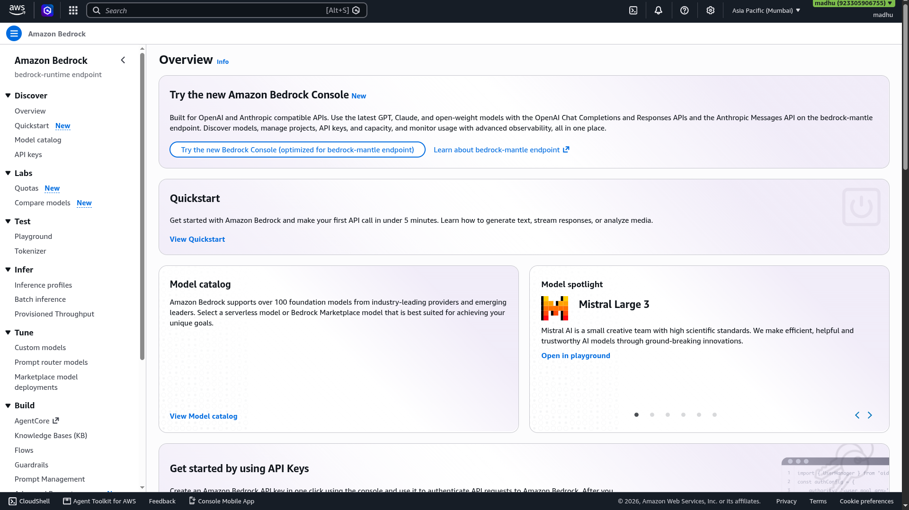
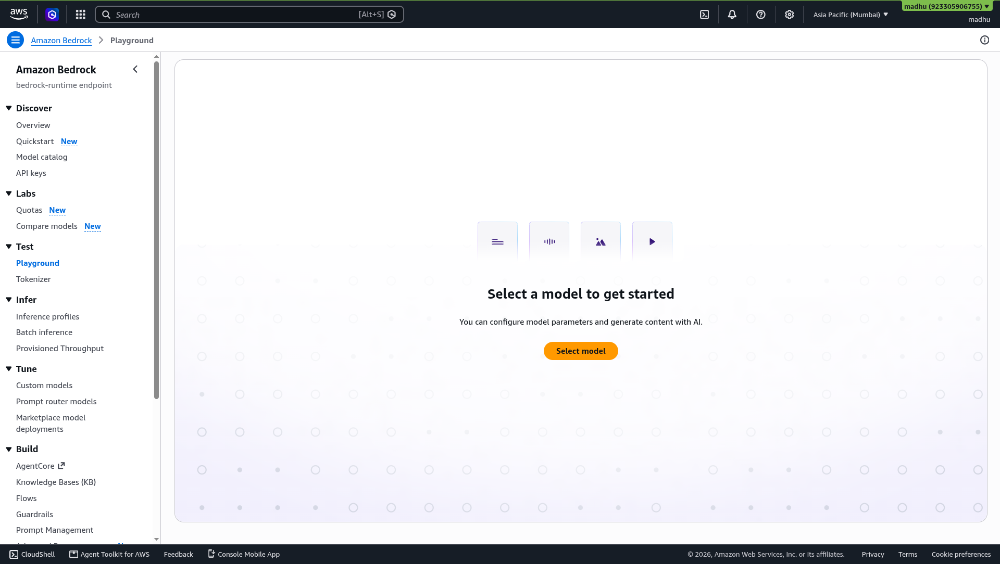

# Chapter 07 — Hands-On Lab: Amazon EC2 Virtual Machine

**Day 1 | 01:00 PM – 01:15 PM | Core Lab**

---

## 🎯 What You Will Do

Launch a virtual computer in the AWS cloud, note its public IP, and safely terminate it after the lab.

---

## 💻 What is Amazon EC2?

<p align="center">
  
  <br/>
  <b>Amazon Elastic Compute Cloud</b>
</p>

EC2 gives you virtual machines in the cloud. You pick the operating system and hardware configuration, launch it in under a minute, and pay only while it runs.

<p align="center">

```
YOUR LAPTOP                   EC2 IN THE CLOUD
───────────────────           ─────────────────────────────
Fixed hardware                Choose any CPU / RAM / storage
One OS                        Any OS: Ubuntu, Windows, Amazon Linux
Always on your desk           Runs in AWS data centers globally
Consumes power 24/7           Pay only when running
```

</p>

---

## 👣 Step-by-Step

### Step 1 — Navigate to EC2

```
AWS Console → Search: EC2 → Click EC2
→ Click "Launch instance" (orange button)
```

<p align="center">
  
  <br/>
  <em>EC2 Console — click "Launch instance" to start configuring your virtual machine</em>
</p>

---

### Step 2 — Name and OS

```
Name  →  my-first-instance

AMI   →  Ubuntu Server 22.04 LTS (HVM), SSD Volume Type
          Architecture: 64-bit (x86)
```

---

### Step 3 — Instance Type

```
Instance type  →  t2.micro    ✅ Free Tier eligible
```

---

### Step 4 — Key Pair

```
Key pair  →  Click "Create new key pair"

  Key pair name    →  my-workshop-key
  Key pair type    →  RSA
  File format      →  .pem

→ Click "Create key pair"
```

> ⚠️ The `.pem` file downloads automatically. **Save it somewhere safe.** You cannot download it again.

---

### Step 5 — Network Settings

```
✅ Allow SSH traffic from    →  My IP
✅ Allow HTTP traffic from the internet
```

---

### Step 6 — Launch

```
Storage  →  Leave default (8 GiB gp3)
→ Click "Launch instance"
→ Click "View all instances"
```

Wait until **Instance state** shows **Running ✅**

<p align="center">
  
  <br/>
  <em>Instance state: Running — your virtual machine is live in the AWS cloud</em>
</p>

---

### Step 7 — (Optional) Connect via SSH

Open your terminal and run:

```bash
chmod 400 my-workshop-key.pem
ssh -i my-workshop-key.pem ubuntu@YOUR-PUBLIC-IP
```

Try a few commands inside your cloud machine:

```bash
whoami
uname -a
ls /
```

You are inside a computer running in an AWS data center. That is real cloud engineering.

---

## 🧹 Clean-Up — Do Not Skip This

EC2 charges by the hour. Always terminate when done:

```
EC2 → Instances → Select instance
→ Instance state → Terminate instance → Confirm
```

> **Terminated** = permanently deleted, all charges stop immediately.
> **Stopped** = paused but storage still charges.

---

## 🌐 Celebrate This Moment

> 💻 You just launched a virtual machine on AWS!
> Share it: **[@awssbg_dbit](https://www.instagram.com/awssbg_dbit/)**
> **#AWSBuildersLab #EC2 #CloudComputing #HexaVerse26**

---

## ✅ Chapter Checklist

- [ ] EC2 instance launched with Ubuntu 22.04
- [ ] t2.micro (Free Tier) selected
- [ ] Key pair downloaded and saved
- [ ] Instance reached Running state
- [ ] Instance terminated after the lab

---

## 🏆 Badge Unlocked

> ### 💻 CLOUD ENGINEER
> You launched a virtual machine in the cloud. That is a real, job-ready skill.

---

> ✅ **Labs done. Time for lunch!**
>
> 🍽️ **Lunch Break — 01:15 PM to 01:45 PM**
>
> Before you go, confirm:
> - IAM user created ✅
> - S3 website live ✅
> - EC2 instance launched and terminated ✅
>
> **Come back for:**
> ### 👉 [Chapter 08 — AWS Bedrock & Generative AI](08-bedrock.md)
