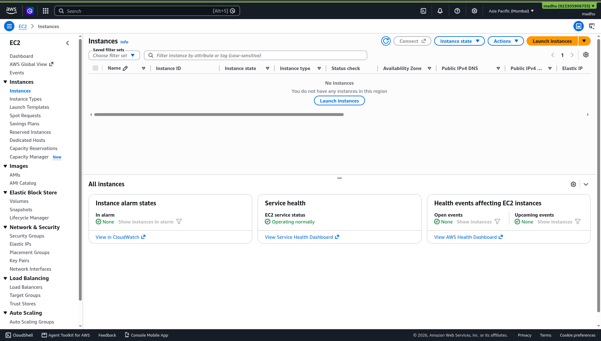

# Chapter 07 — Hands-On Lab: Amazon EC2 Virtual Machine

**Day 1 | 01:00 PM – 01:15 PM | Core Lab**

---

## 🎯 What You Will Do

Launch a virtual machine on AWS, deploy a React application on it using Node.js and Nginx, and access it live from a browser.

---

## 💻 What is Amazon EC2?

<p align="center">
  
  <br/>
  <b>Amazon Elastic Compute Cloud</b>
</p>

EC2 gives you virtual machines in the cloud. You pick the operating system and hardware configuration, launch it in under a minute, and pay only while it runs.

<p align="center">

```
YOUR LAPTOP                   EC2 IN THE CLOUD
───────────────────           ─────────────────────────────
Fixed hardware                Choose any CPU / RAM / storage
One OS                        Any OS: Ubuntu, Windows, Amazon Linux
Always on your desk           Runs in AWS data centers globally
Consumes power 24/7           Pay only when running
```

</p>

---

## 🚀 Part A — Launch Your EC2 Instance

### Step 1 — Navigate to EC2

```
AWS Console → Search: EC2 → Click EC2
→ Click "Launch instance" (orange button)
```

<p align="center">
  
  <br/>
  <em>EC2 Dashboard — click "Launch instance" to start configuring your virtual machine</em>
</p>

---

### Step 2 — Name and OS

On the Launch an instance page, fill in the name and choose your operating system:

```
Name  →  my-first-instance

AMI   →  Ubuntu Server 22.04 LTS (HVM), SSD Volume Type
          Architecture: 64-bit (x86)
```

<p align="center">
  
  <br/>
  <em>Enter a name and select Ubuntu from the Quick Start AMIs</em>
</p>

---

### Step 3 — Instance Type

```
Instance type  →  t2.micro    ✅ Free Tier eligible
```

---

### Step 4 — Key Pair

```
Key pair  →  Click "Create new key pair"

  Key pair name    →  my-workshop-key
  Key pair type    →  RSA
  File format      →  .pem

→ Click "Create key pair"
```

> ⚠️ The `.pem` file downloads automatically. **Save it somewhere safe.** You cannot download it again.

---

### Step 5 — Network Settings

```
✅ Allow SSH traffic from    →  My IP
✅ Allow HTTP traffic from the internet
```

<p align="center">
  
  <br/>
  <em>Select or create a key pair and configure SSH + HTTP access rules</em>
</p>

---

### Step 6 — Storage and Launch

```
Storage  →  Leave default (8 GiB gp3)
```

<p align="center">
  
  <br/>
  <em>Leave storage at default 8 GiB gp3, then click "Launch instance"</em>
</p>

```
→ Click "Launch instance"
→ Click "View all instances"
```

---

### Step 7 — Wait for Running State

After launching, you will see the Instances list. Wait until **Instance state** shows **Running ✅**

<p align="center">
  
  <br/>
  <em>Your instance will appear here — wait for Instance state to show "Running"</em>
</p>

---

## 🌐 Part B — Deploy the React App on EC2

SSH into your instance and follow the steps below to get the workshop React portfolio live on your EC2 server.

### Step 1 — Connect via SSH

Open your terminal and run:

```bash
chmod 400 my-workshop-key.pem
ssh -i my-workshop-key.pem ubuntu@<YOUR-EC2-PUBLIC-IP>
```

Replace `<YOUR-EC2-PUBLIC-IP>` with the **Public IPv4 address** shown in the EC2 console.

---

### Step 2 — Update the System

Once inside the instance, update all core system packages:

```bash
sudo apt update && sudo apt upgrade -y
```

---

### Step 3 — Install Node.js and npm

Install Node.js version 20 along with npm:

```bash
# Download and set up the NodeSource repository
curl -fsSL https://deb.nodesource.com/setup_20.x | sudo -E bash -

# Install Node.js
sudo apt install -y nodejs

# Install npm
sudo apt install -y npm
```

Verify the installation:

```bash
node -v    # Expected: v20.x.x
npm -v     # Expected: 10.x.x
```

---

### Step 4 — Install Git and Clone the Repository

```bash
# Install Git
sudo apt install -y git

# Clone the workshop repository
git clone https://github.com/kanaka2001/AIML-workshop.git

# Move into the React app folder
cd AIML-workshop/react-web-portal
```

---

### Step 5 — Install Dependencies and Build

```bash
# Install all package dependencies
npm install --allow-scripts

# Compile the app — generates a /dist folder
npm run build
```

> 💡 The `dist/` folder contains your production-ready static files — HTML, CSS, and JavaScript bundled and optimised.

---

### Step 6 — Install Nginx and Deploy

```bash
# Install Nginx web server
sudo apt install -y nginx

# Copy all built files to Nginx's web root
sudo cp -r dist/* /var/www/html/

# Start Nginx and enable it on boot
sudo systemctl start nginx
sudo systemctl enable nginx
```

---

### Step 7 — Open the App in a Browser

Open any browser and navigate to:

```
http://<your-ec2-public-ip>
```

Your React portfolio is now live, served directly from your EC2 instance. 🎉

> 💡 **How to find your public IP:**
> EC2 Console → Instances → Click your instance → Copy **Public IPv4 address**

---

## 🧹 Clean-Up — Do Not Skip This

EC2 charges by the hour. Always terminate when done with the lab:

```
EC2 → Instances → Select instance
→ Instance state → Terminate instance → Confirm
```

> **Terminated** = permanently deleted, all charges stop immediately.
> **Stopped** = paused but storage still charges.

---

## 🌐 Celebrate This Moment

> 💻 You just deployed a React app on an AWS EC2 server!
> Share it: **[@awssbg_dbit](https://www.instagram.com/awssbg_dbit/)**
> **#AWSBuildersLab #EC2 #ReactJS #CloudComputing #HexaVerse26**

---

## ✅ Chapter Checklist

- [ ] EC2 instance launched with Ubuntu 22.04
- [ ] t2.micro (Free Tier) selected
- [ ] Key pair downloaded and saved
- [ ] Instance reached Running state
- [ ] Node.js 20 and npm installed
- [ ] Repository cloned and app built
- [ ] Nginx installed and app deployed
- [ ] App accessible at `http://<public-ip>`
- [ ] Instance terminated after the lab

---

## 🏆 Badge Unlocked

> ### 💻 CLOUD ENGINEER
> You launched a VM, installed a full web stack, and deployed a real React app. That is a job-ready skill.

---

> ✅ **Labs done. Time for lunch!**
>
> 🍽️ **Lunch Break — 01:15 PM to 01:45 PM**
>
> Before you go, confirm:
> - IAM user created ✅
> - S3 website live ✅
> - EC2 instance launched and React app deployed ✅
>
> **Come back for:**
> ### 👉 [Chapter 08 — AWS Bedrock & Generative AI](08-bedrock.md)
