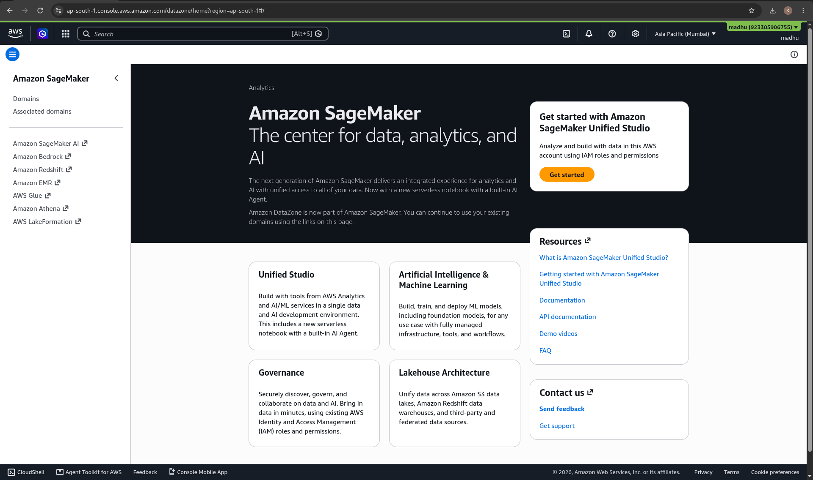
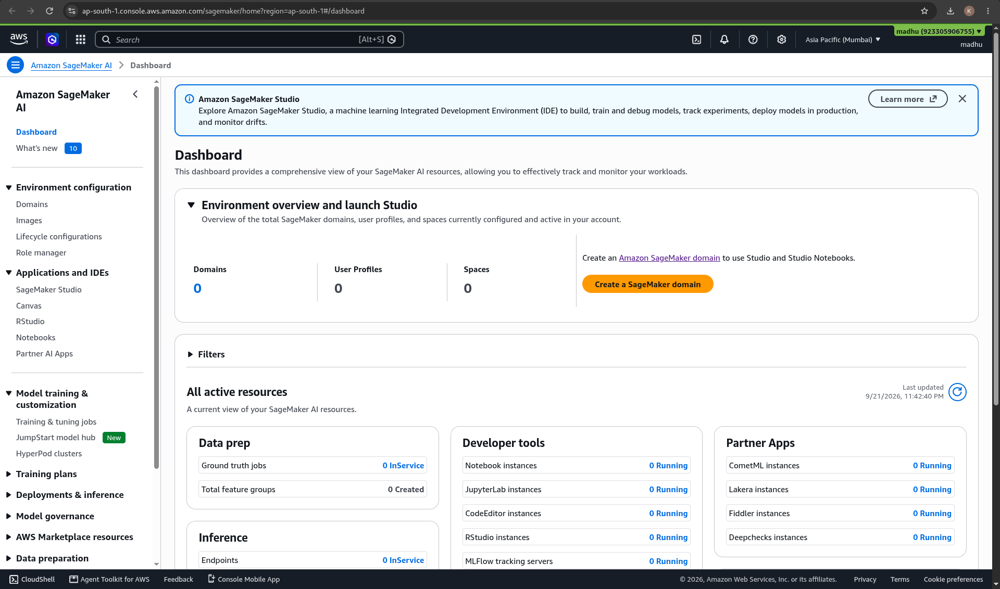
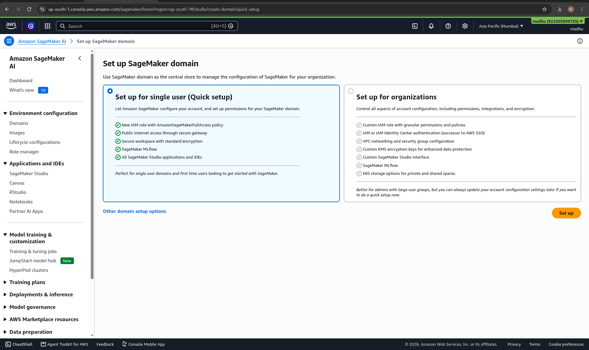
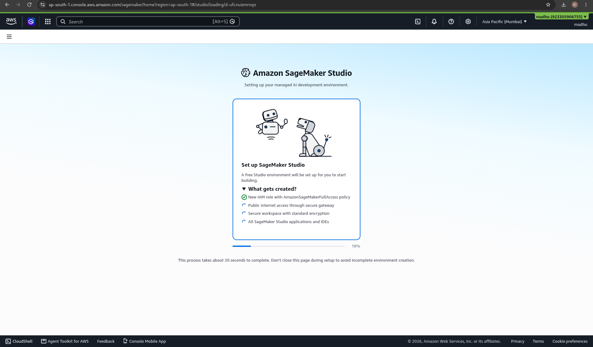
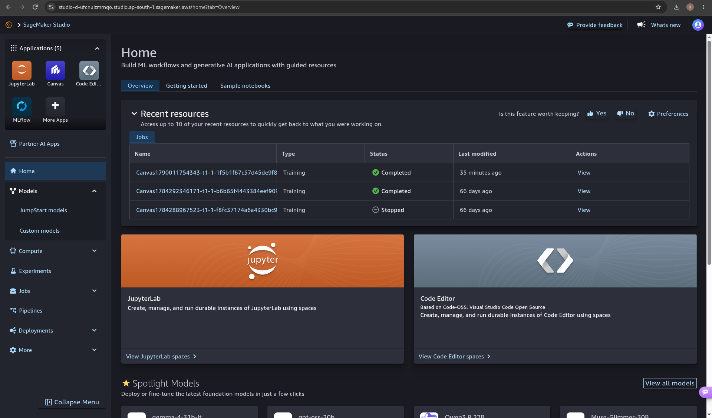
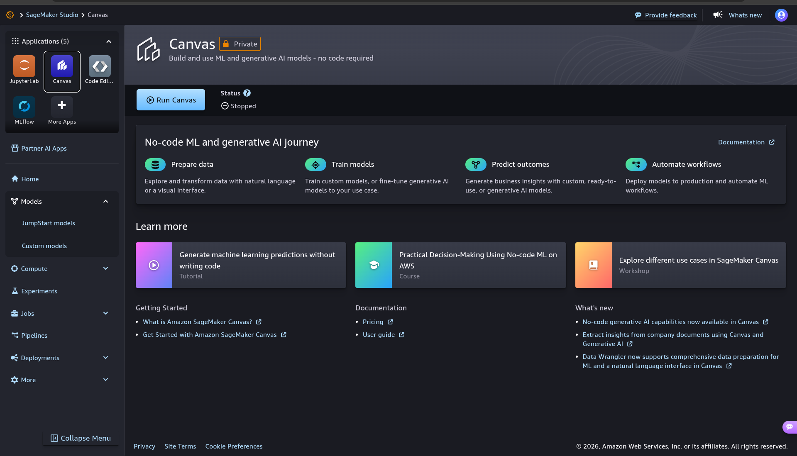
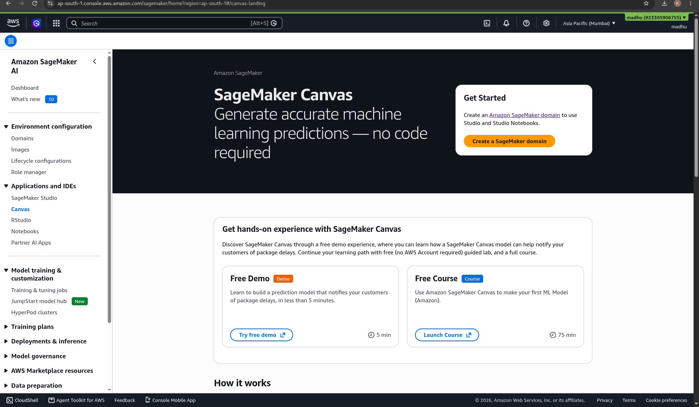
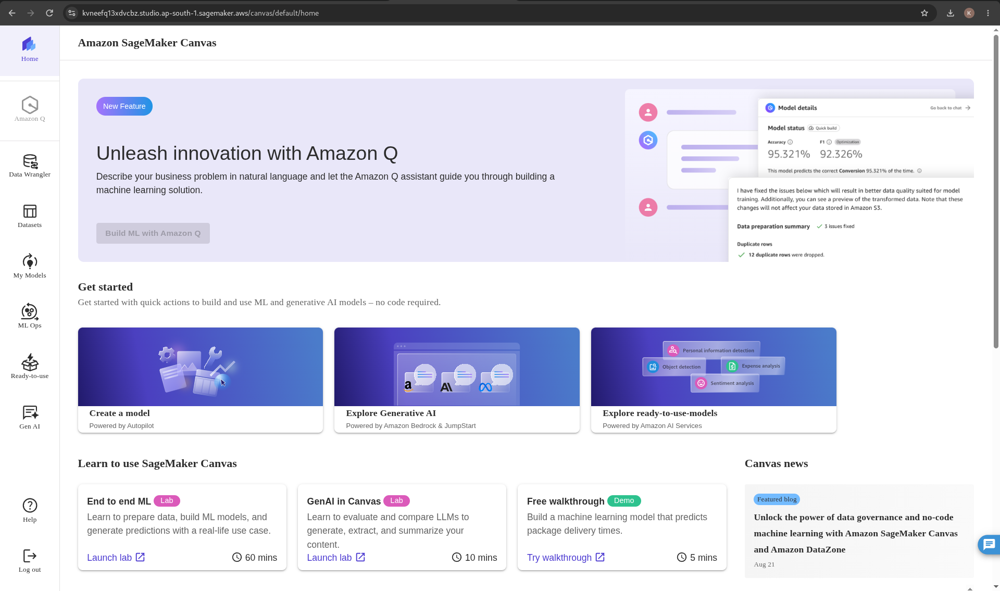
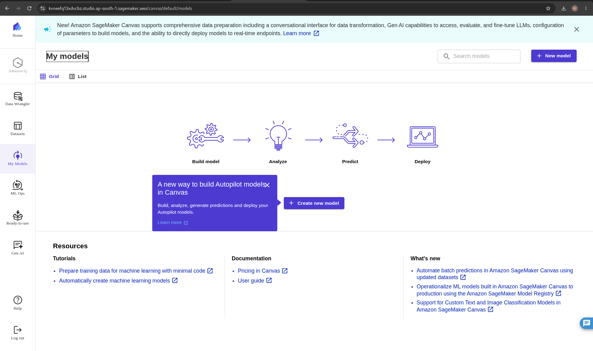
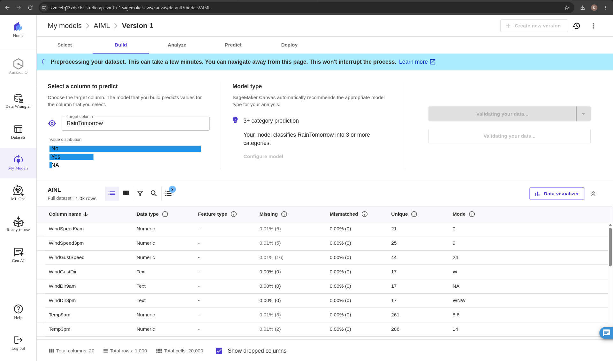

# Chapter 12 — Hands-On Lab: MLOps Pipeline with SageMaker Canvas

**Day 2 | 10:30 AM – 11:55 AM | 85 minutes**

---

## 🎯 What You Will Do

Build a complete end-to-end machine learning pipeline — from raw data to a live real-time prediction API — using Amazon SageMaker Canvas. No code required.

<p align="center">
  
  <br/>
  <b>Amazon SageMaker Canvas</b>
</p>

---

## 📋 Before You Start

- [ ] `student_placement.csv` file is on your laptop
- [ ] Signed into the AWS Console
- [ ] Region set to **Asia Pacific (Mumbai) ap-south-1**

---

## 🗺️ The Full Journey

```
AWS Console
    ↓
SageMaker → Canvas
    ↓
Import Dataset
    ↓
Create Model → Quick Build
    ↓
Analyze Accuracy & Feature Importance
    ↓
Single Prediction (What-If testing)
    ↓
Deploy → Live API Endpoint
```

---

## Phase 1 — Navigating to SageMaker Canvas

### Step 1 — Log In and Set Your Region

Open your browser (Google Chrome recommended) and log in to your AWS Console.

In the **top-right corner**, click the region dropdown next to your account name and select:

```
Asia Pacific (Mumbai)  ap-south-1
```

> ⚠️ Make sure everyone in the room uses the **same region**. Resources in different regions are completely isolated.

---

### Step 2 — Search for SageMaker

Click inside the **Search** bar at the top-left (next to the orange AWS logo).

Type `SageMaker` and click **Amazon SageMaker AI** from the results.

<p align="center">
  
  <br/>
  <em>Amazon SageMaker — the center for data, analytics, and AI on AWS</em>
</p>

---

### Step 3 — Open the SageMaker AI Dashboard

You will land on the SageMaker AI Dashboard. This shows your domains, user profiles, and active resources.

<p align="center">
  
  <br/>
  <em>SageMaker AI Dashboard — Domains: 0, User Profiles: 0. Click "Create a SageMaker domain" to begin</em>
</p>

---

### Step 4 — Set Up a SageMaker Domain (First Time Only)

If this is your first time, you need to create a domain. Click **Create a SageMaker domain**.

On the setup screen, select **Set up for single user (Quick setup)** — this is perfect for individual learners.

```
✅ New IAM role with AmazonSageMakerFullAccess policy
✅ Public internet access through secure gateway
✅ Secure workspace with standard encryption
✅ SageMaker MLflow
✅ All SageMaker Studio applications and IDEs

→ Click "Set up"
```

<p align="center">
  
  <br/>
  <em>Choose "Set up for single user (Quick setup)" — then click Set up</em>
</p>

SageMaker Studio will now provision your environment. This takes about 20 seconds — **do not close the page**.

<p align="center">
  
  <br/>
  <em>SageMaker Studio is setting up your managed AI development environment — wait for it to complete</em>
</p>

---

### Step 5 — Launch Canvas from the Studio

Once loading completes, you will land inside **SageMaker Studio Home**. You can see JupyterLab, Canvas, Code Editor, and your recent training jobs here.

<p align="center">
  
  <br/>
  <em>SageMaker Studio Home — click Canvas in the left Applications panel or in the app tiles</em>
</p>

In the left sidebar, under **Applications and IDEs**, click **Canvas**.

You will see the Canvas app page. Click the blue **Run Canvas** button.

<p align="center">
  
  <br/>
  <em>Canvas app — Status: Stopped. Click "Run Canvas" to start your no-code ML workspace</em>
</p>

---

## Phase 2 — Setting Up the Canvas Workspace

### Step 6 — Wait for Canvas to Start

Once you click **Run Canvas**, the Status column will change:

```
Stopped → Pending → Starting → Running ✅
```

> ⏳ This background provisioning takes **2 to 4 minutes**. Do not refresh or close the page.

When status turns green **Running**, a light blue **Open Canvas ↗** button appears. Click it.

Canvas opens in a new browser tab with the full Home dashboard.

<p align="center">
  
  <br/>
  <em>SageMaker Canvas — "Generate accurate machine learning predictions, no code required"</em>
</p>

---

### Step 7 — The Canvas Home Screen

Inside Canvas you will see the full no-code ML journey dashboard.

<p align="center">
  
  <br/>
  <em>Canvas Home — Build ML with Amazon Q, Create a model, Explore Generative AI, all from one screen</em>
</p>

---

## Phase 3 — Building a No-Code ML Model

### 📥 Step 8 — Import Your Dataset

In the **left vertical sidebar**, click the **Datasets** icon (looks like a small database grid).

Click the purple **Import data** button in the top-right corner.

```
Import data → Tabular (CSV or Parquet files)
Dataset name → Type: student_placement_data
→ Click "Create"

Source → Amazon S3
→ Click into the system bucket: sagemaker-[region]-[account-id]
→ Locate: student_placement.csv
→ Check the box next to it
→ Click "Import data" (bottom-right of the pop-up)
```

> 💡 If a pink error message appears during the preview — **ignore it** and click Import data anyway. It does not affect the import.

---

### 🧠 Step 9 — Create a New Model

In the **left sidebar**, click the **My Models** icon (lightbulb and network symbol).

<p align="center">
  
  <br/>
  <em>My Models — the Build → Analyze → Predict → Deploy pipeline. Click "+ New model" to begin</em>
</p>

```
Top-right → Click "+ New model"

Model name       →  Placement_Predictor
Model type       →  Predictive analytics
→ Click "Create"

Select dataset   →  student_placement_data
→ Click "Select dataset"
```

---

### Step 10 — Configure and Train

In the **Build** tab, set your target column — the value you want the model to predict:

```
Target column → Select: Placed
```

Canvas will automatically recommend the model type (e.g., *2-category prediction*).

<p align="center">
  
  <br/>
  <em>Build tab — select your target column (e.g., RainTomorrow / Placed), review 1k rows and column stats</em>
</p>

Once ready, click **Quick Build** (top-right, orange button).

> ⏳ Quick Build runs AutoML in the background — **3 to 6 minutes**. While it trains, read the box below.

---

## 📖 What Happens During Quick Build

Canvas runs an automated ML pipeline on your behalf:

```
Cleans the data
      ↓
Engineers new features automatically
      ↓
Tries multiple ML algorithms (XGBoost, Linear, Neural Net...)
      ↓
Tunes each algorithm automatically
      ↓
Picks the best-performing model
      ↓
Returns accuracy score + feature importance chart
```

This is what data scientists used to spend **weeks** doing by hand. Canvas does it in minutes.

---

## Phase 4 — Simple MLOps: Prediction & Deployment

### 🔍 Step 11 — Analyze the Results

Once Quick Build completes, the **Analyze** tab opens automatically.

**Look for two things:**

```
1. Accuracy score
   e.g., 94.2% → the model predicted the correct outcome
                  94.2% of the time on unseen test data

2. Feature Importance chart
   → Shows which columns drove the predictions most
   → High-impact features are often: GPA, Internships, CGPA
```

---

### 🧪 Step 12 — Test with Single Predictions

Click the **Predict** tab at the top center of the interface.

```
→ Click "Single Prediction"
```

Form fields will appear — one for each column in your dataset.

**Test 1 — High performer:**
```
Set GPA → 9.5   (or similar high value)
→ Click "Generate Prediction"
→ Note the prediction result
```

**Test 2 — Low performer:**
```
Drop GPA → 4.2  (or similar low value)
→ Click "Generate Prediction"
→ Watch the output shift
```

> 💡 This "what-if" testing is called **inference**. You are querying the trained model in real time.

---

### 🚀 Step 13 — Deploy as a Live API Endpoint

```
From the prediction view → Click "Deploy"

Endpoint name  →  placement-api-endpoint
→ Click "Deploy" (confirmation button)
```

Wait until the endpoint status changes:

```
Deploying → InService ✅
```

**InService** means your model is now a live REST API running in the AWS cloud. Any app can now call it with a student's data and get a placement prediction back instantly.

---

## 🧹 Clean-Up — Important

Deployed endpoints **charge by the hour**. After the lab, delete it:

```
Canvas → Deployments → Select endpoint: placement-api-endpoint
→ Delete endpoint → Confirm
```

---

## 🌐 Share Your ML Model!

> 🔬 You just built, trained, tested, and deployed a machine learning model — without writing a single line of code.
>
> Share it: **[@awssbg_dbit](https://www.instagram.com/awssbg_dbit/)**
> **#AWSBuildersLab #MLOps #SageMakerCanvas #HexaVerse26**

Stay connected for upcoming ML events:

<p align="center">

| | |
|:---:|:---:|
| 📢 [WhatsApp Channel](https://whatsapp.com/channel/0029Vb76rEYATRSlFR1mOg2X) | Resources and upcoming ML event announcements |
| 💼 [LinkedIn](https://www.linkedin.com/company/aws-sbg-dbit/) | Professional ML and cloud community |

</p>

---

## ✅ Chapter Checklist

- [ ] Region set to Mumbai (ap-south-1)
- [ ] SageMaker domain created (Quick Setup)
- [ ] Canvas opened and Running
- [ ] `student_placement_data` imported
- [ ] `Placement_Predictor` model created
- [ ] Target column set and Quick Build completed
- [ ] Accuracy score and Feature Importance reviewed
- [ ] Single prediction tested with high and low values
- [ ] Model deployed as `placement-api-endpoint`
- [ ] Endpoint deleted after the lab

---

## 🏆 Badge Unlocked

> ### 🔬 MLOPS ENGINEER
> You built, trained, tested, and deployed a machine learning model. Without writing a line of code.

---

> ✅ **Done? Move to the next chapter:**
> ### 👉 [Chapter 13 — PartyRock AI Builder](13-partyrock.md)
