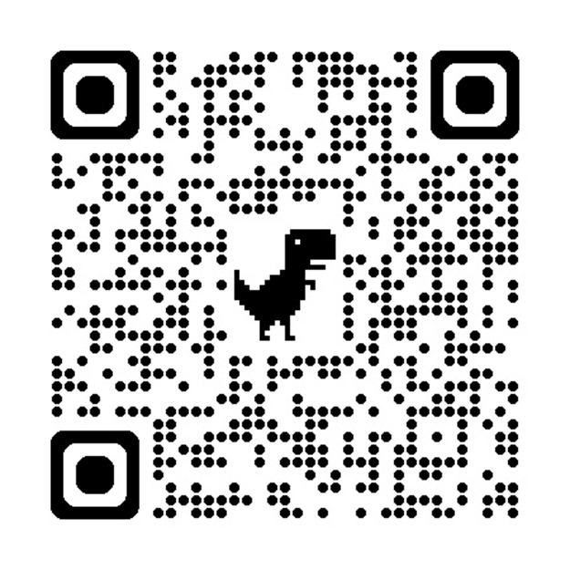
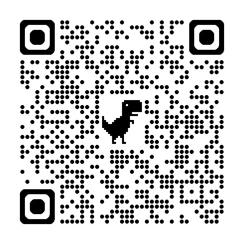

# Chapter 16 — What's Next: Take Action

**AWS Student Builder Group – DBIT | HexaVerse CloudFest '26**

---

## 📣 Section Overview

This chapter has three action items before you leave today:

| # | Action | Time |
|---|---|---|
| 1 | Submit the official AWS feedback form | 2 min |
| 2 | Submit the AWS SBG–DBIT feedback form | 2 min |
| 3 | Register for the upcoming PartyRock Hack event | 1 min |

> **Please complete the feedback forms before you leave — it directly helps us improve future workshops and grows the AWS community at DBIT.**

---

## 📝 Feedback Forms

### 1 — Official AWS Event Feedback

This is the **official Amazon Web Services feedback survey** for the event. Your responses go directly to the AWS team and help shape future student programs.

**How to fill it:**

| Field | What to enter |
|---|---|
| Name of Student Builder Group | `AWS Student Builder Group at Don Bosco Institute of Technology` |
| Name of event | `AWS Builders Lab` |
| Event date | `21 / 09 / 2026` |
| Type of event | Hands-on workshop covering AWS core services (IAM, S3, EC2, Bedrock, SageMaker) and PartyRock generative AI builder |
| Other fields | Fill from your own experience |

<p align="center">
  <a href="https://pulse.amazon/survey/UPCU4UQO?p=0">
    
  </a>
  <br/><br/>
  <strong>Scan the QR code or click the link below:</strong>
  <br/>
  <a href="https://pulse.amazon/survey/UPCU4UQO?p=0"><strong>pulse.amazon/survey/UPCU4UQO</strong></a>
</p>

---

### 2 — AWS SBG–DBIT Feedback Form

This is **our internal feedback form** for the AWS Student Builders Group at DBIT. Your honest responses help us organise better events, improve workshop content, and understand what you found most valuable.

> Takes less than 2 minutes. Every response counts.

<p align="center">
  <a href="https://forms.gle/7PzATmjkJSRV6gm16">
    
  </a>
  <br/><br/>
  <strong>Scan the QR code or click the link below:</strong>
  <br/>
  <a href="https://forms.gle/7PzATmjkJSRV6gm16"><strong>forms.gle/7PzATmjkJSRV6gm16</strong></a>
</p>

---

## ⚡ Upcoming Signature Event

<p align="center">
  <strong>THE PARTYROCK HACK</strong>
  <br/>
  <em>Building the Future with AI</em>
</p>

### 🗓️ Event Details

| | |
|---|---|
| **Date** | 24 September 2026 |
| **Venue** | A-001, DBIT Campus |
| **Format** | Individual · Offline · 3 Rounds |
| **Registration** | ₹50 · Solo Entry |

---

### 🏆 What is PartyRock Hack?

**PartyRock Hack** is a three-round individual challenge that takes participants from testing their AWS and cloud knowledge to building practical AI-powered applications. Each stage introduces a different kind of problem-solving, making the experience progressively more hands-on.

Participants work with **AWS PartyRock** to explore data, experiment with AI-powered applications, and develop a solution to a campus-focused challenge — all under time constraints.

Solutions are evaluated on **functionality, usability, innovation, and practical value**.

---

### 🔁 The Three Rounds

```
Round 1 — Cloud Blitz ⛈️
  Test your AWS and cloud knowledge
  Live quiz with per-question countdown timers
        ↓
Round 2 — BuildForge ⭐
  Build a working AI app using AWS PartyRock
  Industrial problem statements and dataset challenges
        ↓
Round 3 — Campus Innovator 🎓
  Solve a real campus-life problem
  Live pitch to an expert judging panel at DBIT
```

> **Knowledge → Experimentation → Creation**

---

### 🚀 Register for PartyRock Hack

<p align="center">
  <a href="https://awsevents.dbit.edu.in/departments/aiml">
    <strong>👉 awsevents.dbit.edu.in/departments/aiml</strong>
  </a>
  <br/>
  <em>Solo entry · ₹50 · Register before seats fill up</em>
</p>

---

## 🤝 Join the AWS Student Builders Group

Want to be part of the team that organises events like this?

**AWS Student Builders Group at DBIT** is looking for motivated students who want to build, learn, and lead in the cloud and AI space.

> Fill the interest form and our team will reach out to you.

<p align="center">
  <a href="https://forms.gle/TcuVTVdGg3TEJwU5A">
    <strong>👉 forms.gle/TcuVTVdGg3TEJwU5A</strong>
  </a>
</p>

---

## 🌐 Stay Connected

<p align="center">

| Platform | Link |
|:---:|:---:|
| 📢 WhatsApp Channel | [Join](https://whatsapp.com/channel/0029Vb76rEYATRSlFR1mOg2X) |
| 📸 Instagram | [@awssbg_dbit](https://www.instagram.com/awssbg_dbit/) |
| 💼 LinkedIn | [Follow](https://www.linkedin.com/company/aws-sbg-dbit/) |
| 🌐 Website | [awsevents.dbit.edu.in](https://awsevents.dbit.edu.in/) |

</p>

---

> ✅ **Continue to:**
> ### 👉 [Chapter 17 — Meet the Speaker](17-speaker.md)
